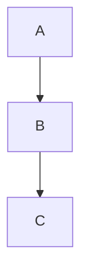

# Markdown 構文全集（完全版）

Markdown（CommonMark + GitHub Flavored Markdown + 拡張記法）の構文を網羅したチートシートです。

---

# 1. 見出し（Heading）

```md
# H1
## H2
### H3
#### H4
##### H5
###### H6
```

---

# 2. 強調（Emphasis）

```md
*斜体*
_斜体_

**太字**
__太字__

***太字 + 斜体***
~~取り消し線~~
```

---

# 3. 段落・改行

```md
段落は空行で区切る

行末にスペース2つで  
改行される
```

---

# 4. 引用（Blockquote）

```md
> 引用
>> 多重引用
```

---

# 5. リスト（List）

## 箇条書き（Unordered）

```md
- item
  - nested
    - deeper
* item
+ item
```

## 番号付き（Ordered）

```md
1. item
2. item
3. item
```

---

# 6. コード（Code）

## インラインコード

```md
`inline code`
```

## コードブロック（フェンス）

```md
```lang
コード
```
```

---

# 7. 水平線（Horizontal Rule）

```md
---
***
___
```

---

# 8. リンク（Link）

```md
[テキスト](https://example.com)
[タイトル付きリンク](https://example.com "title")
```

---

# 9. 画像（Image）

```md


```

---

# 10. 表（Table）

```md
| col1 | col2 | col3 |
|------|------|------|
| a    | b    | c    |
| d    | e    | f    |
```

### 右寄せ・中央寄せ

```md
| 左 | 中央 | 右 |
|:---|:---:|---:|
| a  | b    | c  |
```

---

# 11. タスク一覧（GFM）

```md
- [ ] 未完了
- [x] 完了
```

---

# 12. コードハイライト（GFM）

```md
```javascript
console.log("hello");
```
```

---

# 13. 脚注（Footnote）

```md
本文[^1]

[^1]: 脚注の内容
```

---

# 14. 定義リスト（Definition List）

```md
用語
: 説明文

別の用語
: 説明文
```

---

# 15. 絵文字（Emoji）

```md
:smile:
:rocket:
```

---

# 16. チェックボックス（GFM）

```md
- [ ] task
- [x] done
```

---

# 17. 折りたたみ（Details / Summary）

```md
<details>
<summary>クリックして展開</summary>

内容

</details>
```

---

# 18. HTML 併用（Markdown + HTML）

```md
<p style="color:red;">HTMLも使える</p>
```

---

# 19. 数式（MathJax / LaTeX）

※ GitHub は対応していないが、Docs/Note系ツールでは使える

```md
インライン: $a^2 + b^2 = c^2$

ブロック:
$$
\frac{1}{2}mv^2
$$
```

---

# 20. コメント（Markdown コメント）

```md
<!-- コメント（表示されない） -->
```

---

# 21. 引用付きコード（GFM）

```md
> ```sql
> SELECT * FROM users;
> ```
```

---

# 22. ショートカット記法（GitHub）

## @メンション

```md
@username
```

## Issue / PR 参照

```md
#123
```

---

# 23. Mermaid（図表）

```md

```

---

# 24. タイムライン（GitHub）

```md
- 2024-01-01: Start
- 2024-02-01: Release
```

---

# 25. YAML フロントマター（MD拡張）

```md
---
title: "Markdown Document"
date: 2024-01-01
tags: [doc, md]
---
```

---

# 26. 罫線付き引用（GFM）

```md
> ---
> 引用内の水平線
> ---
```

---

# 27. 生の URL 自動リンク

```md
https://example.com
```

---

# 28. エスケープ（特殊文字）

```md
\* そのまま表示
\# 見出しにしない
```
